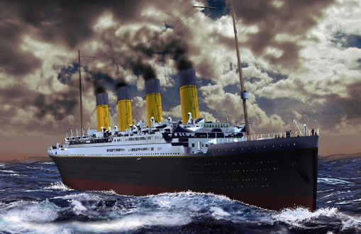

# Titanic
Details on how to obtain a relatively high level of accuracy on Kaggle's "Titanic" Dataset.

The goal of this project is to predict whether a passenger  survived the titanic disaster, given several predictors.

Image Source: https://kids.nationalgeographic.com/explore/history/a-titanic-anniversary/

We also utilize feature engineering to extract additional predictors, and combine multiple Machine Learning models to obtain predictions.

We also highlight some basic visualization techniques using ggplot.
